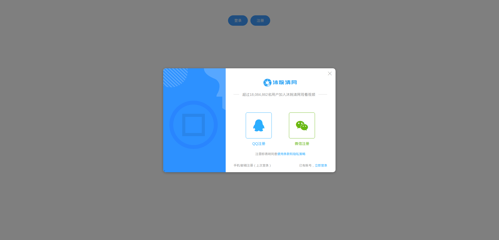

# 美观好看的登录模板 simple-login 
    可以下载下来集成到自己的项目中哦, 只需准备一个登录按钮, 一个注册按钮, 其他都是我在AccessPanel组件中封装好的.
    项目环境: vue
    弹框依赖 element-ui  
    cnpm i element-ui -S
##### 第三方微信/QQ登录


##### 验证码登录


##### 密码登录


##### 第三方微信/QQ注册


##### 验证码注册


##### 密码注册


## 初始化
```
cnpm install
```

### 编译运行
```
cnpm run serve
```

### 编译
```
cnpm run build
```

### 整理和修复文件
```
cnpm run lint
```
    
